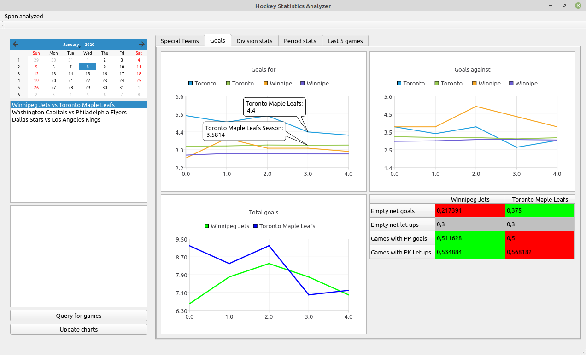
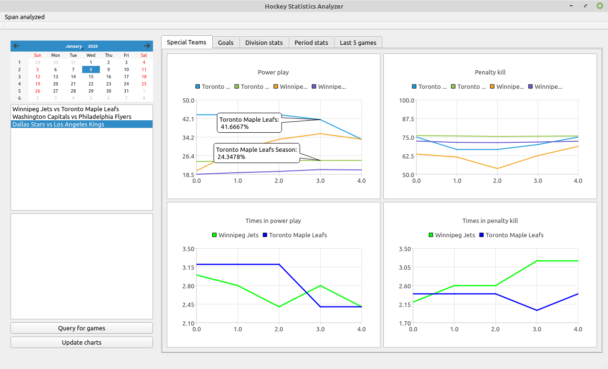
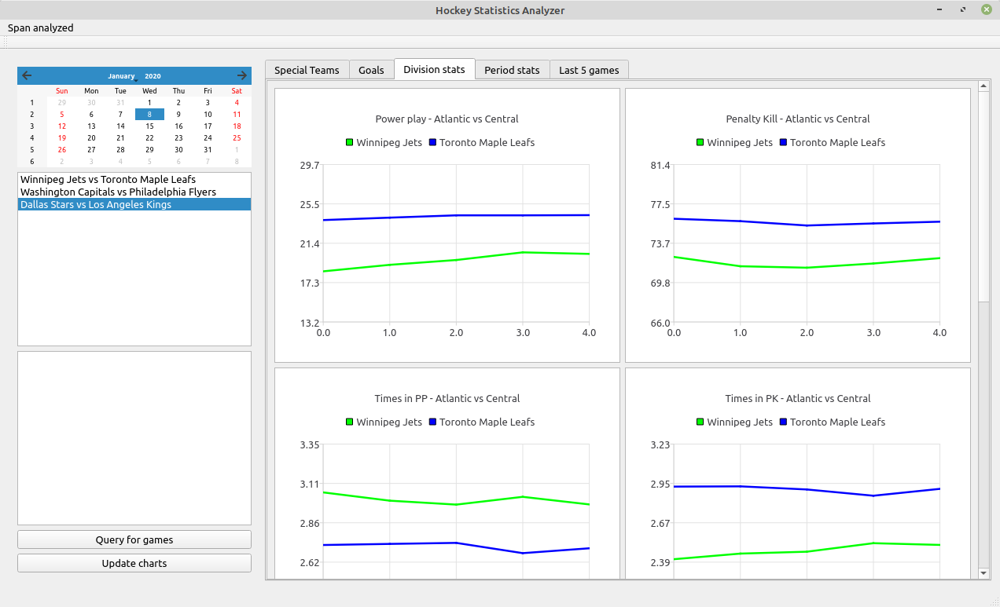
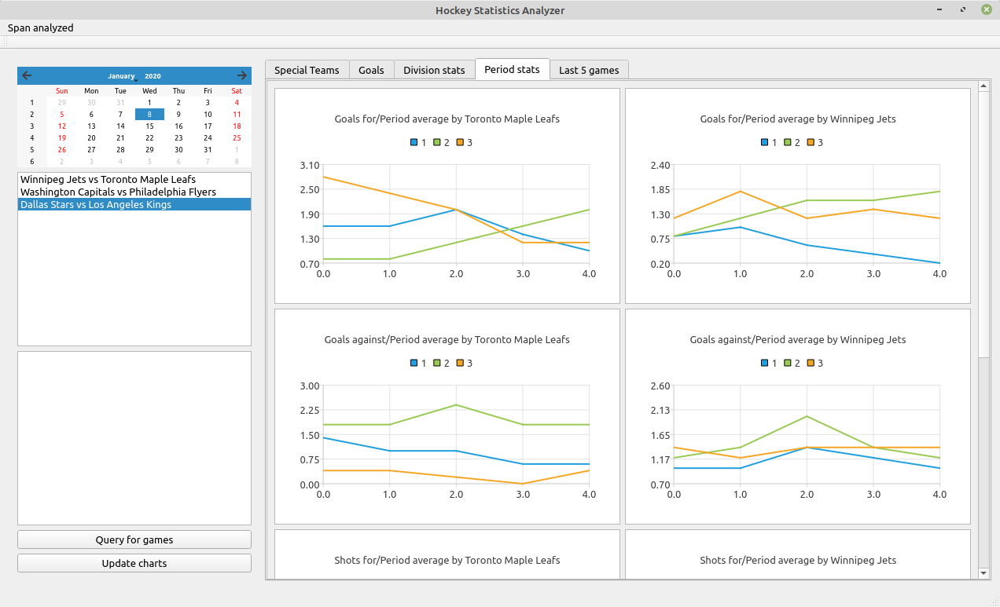
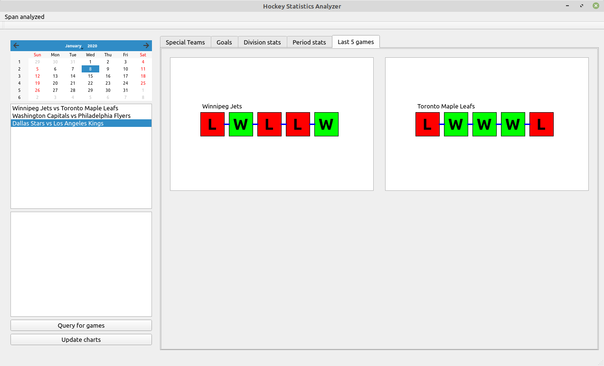
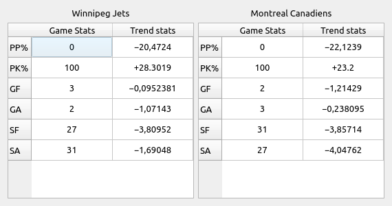
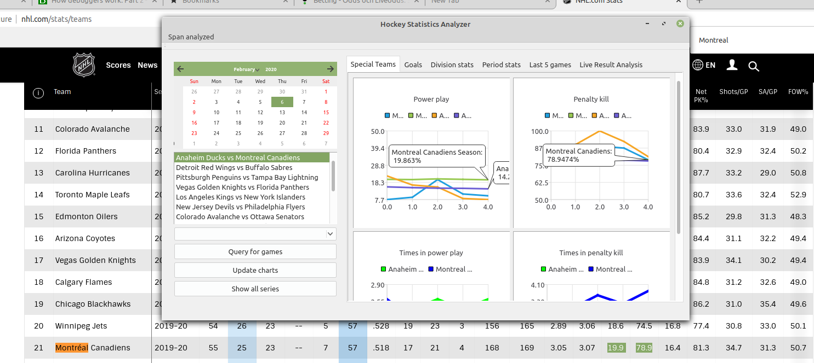

## TODO

1.	(Qt) Implement custom GUI component for Unibet like game-streak, which is a custom chart of sorts. It basically is 5 boxes, 
	containing either the letter "L" or "W" denoting if that game, of the last 5 games (or longer), was won or lost. 
	This box should also have hover capabilities, to trigger an advanced tooltip, basically a full window like tooltip, that 
	will show the statistics of that game, both raw and analyzed data.

	Basically the entire component will look like this:	| ---[L]-[W]-[W]-[L]-[W]---> |
	So everything between the | | will be the canvas of sorts, and the boxes on the canvas will be custom widgets as well,
	so that we can hook signals and slots together with them, provide a mapToPoint/mapToValue functionality to tell the user
	of the widget where they are located on the canvas (mapToPoint), or to what data, a specific widget instantiation 
	is pointing to (mapToValue).

	And when the user hovers over one of the boxes, the related data will be displayed in a custom tooltip like GUI Widget
2. (Qt) Improve on the line charts that Qt provides. They are abhorrent.
	a. Add squares to denote where the datapoints are.
	b. Add custom tooltip functionality besides the "call out", it is much too simple.
3. (Backend) Figure out what data we can scrape that ML can be used to gain new info from. (This might never be possible, so this 
	is the absolute last task, seeing as how I have 0 real world experience).
4. (Qt + Backend) Figure out a way, to visualize trend data. What is useful? What kind of trend data can actually tell us something,
	as to how we should be placing our bets? Perhaps a standard/specification of _all_ the different aspects of a game need
	to be developed first, so one can check off boxes of what has been implemented? Yes, that sounds good.

## Features to add / change

Some definitions of Types (in the docs only)
- T GameTime
- A:B Standing 
- S Statistic

- [x] PDO stats
- [ ] Corsi stats
- [ ] Live Result analysis. Examples of questions posed & answers:
	- How many games were won/lost after standing A:B @ T. Permutations: Season & Span of X games, Home/Away
	- How many games were more goals scored after standing A:B @ T. Permutations: Season/Span of X games & Home/Away
	- How many games were more goals let up after standing A:B @ T. Permutations: Season/Span of X games & Home/Away
- [ ] Ask questions about a S, and outcomes after it being true, i.e.
	- How many games were won/lost after winning/losing period 1, 2, 3 (S=Period 1 Wins, T=Period 1, for example)
	- What has been required to be min GF, for team to win (and how often has that been true)
	- What has bene required to be min GA, for team to lose (and how often has that been true)
	- Answering similar questions like this, we should be able to "cut out" a path of likeliness, of a specific out come. Maybe.
- [ ] Adjust EN goal stats, the empty net let ups need to be adjusted to show games where goalie was pulled. If stats say for example 
	  (currently) 32%, this might count for games where the goalie was *not* pulled (usually when deficit is greater than 2 goals), therefore, this
      make the stat not really show the truthyness of how often a goal is let up/made, when it comes to Empty Net scoring.
- [x] Make sure that GF/GA statistics do not account for Shootout goals (which it currently *does*).
- [ ] Distribution analysis of goals made, w/ respect to time. We can create a chart, that displays in what "regions" of game time where most goals are scored / let up, instead of just to static "by period" statistic.
- [ ] Add ability to hide individual series
- [ ] Add ability to "mark" series from different charts (that has to be at least tangientially related) so that comparisons can be made to, perhaps be shown in a popup of sorts.
- [ ] Add a user interface / console that interfaces with the node application that scrapes the stats data, perhaps initially just show progress of scraping to begin with.
- [ ] Add markers for where the data points in the chart actually exists/lives. Since we are using a line diagram, the lines are really just visualization, for the mental model, meaning, so it's easier to spot if trend is going good or bad. But actually marking the data point locations is also useful. The callout currently works, but it's a bit cumbersome to actually having to click/set them.

### Statistics and Trend specification

Statistics come in many shapes and forms, raw stats, are the following ones:

Special Teams efficiency => 
	PK: 1.0 - (Goals let up / Times in penalty kill)
	PP: Scoring / Powerplay attempts

Shot efficiency		=> Scoring / Shots attempted
Save percentage		=> 1-(Goals let up/Shot attempts against)
Goals for		=> Scoring
Goals against		=> Goals let up
Shots for		=> Shots attempted
Shots against		=> Shot attempts against
Corsi			=>
PDO			=>

For most of these raw stats, one can do per-period analysis over a span of games to determine
in what period on average the teams perform best and worse.

## Current UI & Stats viewing
The charts with multiple lines in them, (more than two), show both a 5-game span average statistic, which consists (as the name suggests)
an average of a statistic over the last 5 games at that time. So a goals for, shows the 5-game span average of a statistic, before that game. 
Along with that data, the season average before that game is also displayed. So the values that are at X=4, is what the *current* average is
for respective category.

Per 5-game span average, with also showing the current season average at that date for comparison. Also displays a
table with data of how many games empty net goals were scored and let up, respectively. These only are in respect to games won in Regulation, 
therefore not in over time nor shootout

Some with 5 game span average mixed with the season average. Not all charts are fully implemented with the corresponding season average yet

Shows stats vs division of opponent. One can see the selected game in the list box to the left (which controls what data is displayed in all tabs.
The data displayed in this tab, is all season averages, there is no 5-game span average, as inter-division games are much more rare, than intra division

This tab will show some analysis of the last 5 games played. It currently shows a custom widget that displays whether or not
the a game was won or lost (green/red W/L). When clicked, these show a pop up window, that will display some statistics of the game, in comparison to the 
season trend. This way, we can determine if Team A or B had a better game, in comparison to it's trend it has been having, thus we can tell if Team A won,
because they played better, or because Team B just played so much worse, or a mixture of all combinations. An image of this popup is displayed further down

This shows that our application is indeed displaying the "correct" data. The NHL.com site has the values rounded down to 1 decimal, which we can clearly establish from the image
represents the values we display in our app.